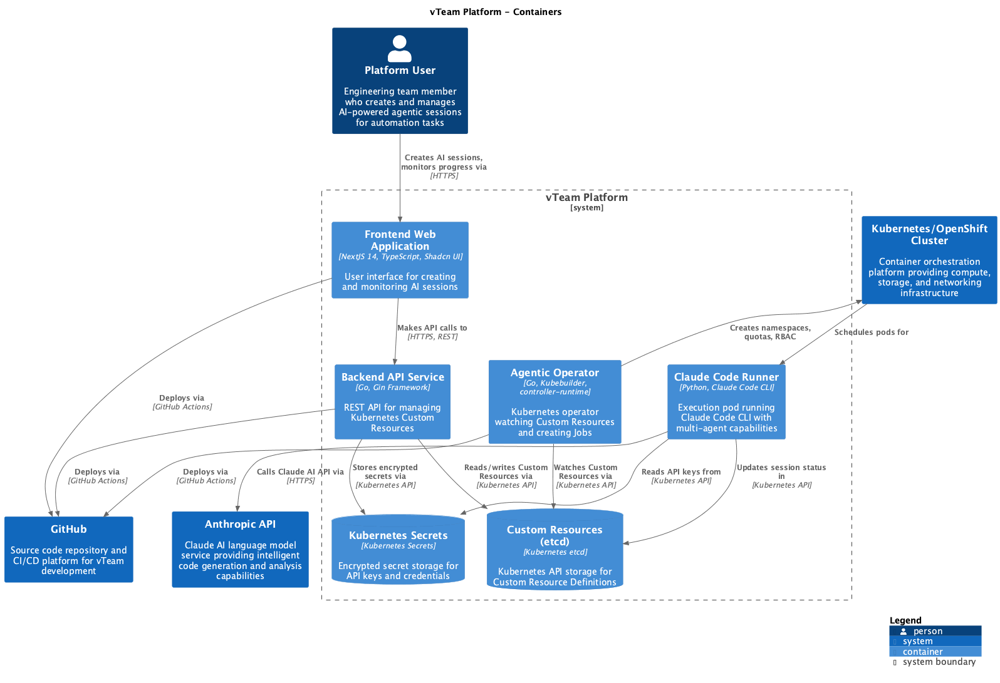
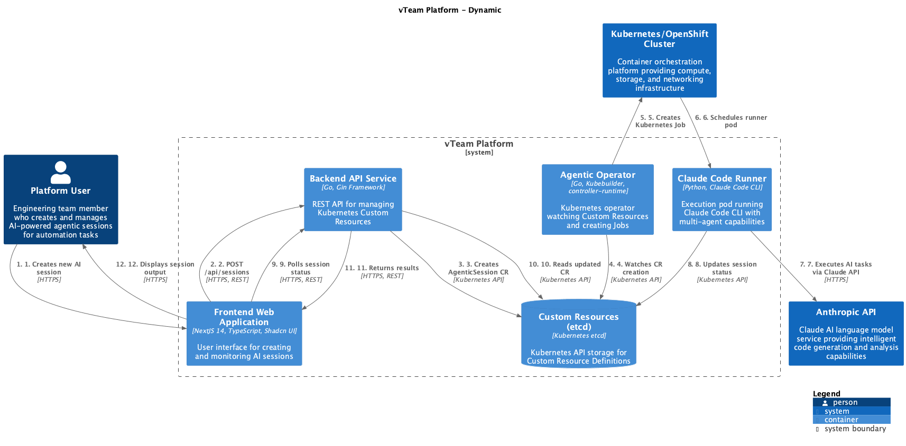

# vTeam: Ambient Agentic Runner

> Kubernetes-native AI automation platform for intelligent agentic sessions with multi-agent collaboration

## Overview

**vTeam** is an AI automation platform that combines Claude Code CLI with multi-agent collaboration capabilities. The platform enables teams to create and manage intelligent agentic sessions through a modern web interface.

### Key Capabilities

- **Intelligent Agentic Sessions**: AI-powered automation for analysis, research, content creation, and development tasks
- **Multi-Agent Workflows**: Specialized AI agents model realistic software team dynamics
- **Kubernetes Native**: Built with Custom Resources, Operators, and proper RBAC for enterprise deployment
- **Real-time Monitoring**: Live status updates and job execution tracking

## Architecture

**Documentation**: [Architecture Overview](docs/architecture/README.md) | [Quick Reference](docs/architecture/QUICK_REFERENCE.md) | [C4 Diagrams](architecture/diagrams/)

The platform follows a microservices architecture deployed on Kubernetes/OpenShift:



### Containers

| Container | Technology | Purpose | Deployment |
|-----------|------------|---------|------------|
| **Frontend** | NextJS 14, TypeScript, Shadcn UI | User interface for session management | Kubernetes Pod + Route |
| **Backend API** | Go, Gin Framework, client-go | REST API for Custom Resource management | Kubernetes Pod + Service |
| **Agentic Operator** | Go, Kubebuilder, controller-runtime | Kubernetes operator orchestrating jobs | Kubernetes Deployment |
| **Claude Code Runner** | Python, Claude Code CLI, Anthropic SDK | AI execution with multi-agent capabilities | Kubernetes Job (ephemeral) |

### Agentic Session Flow



1. **User creates new AI session** via Frontend web interface
2. **Frontend calls Backend API** (POST /api/sessions)
3. **Backend creates AgenticSession CR** in Kubernetes
4. **Operator watches CR creation** and creates Kubernetes Job
5. **Kubernetes schedules Runner pod** with agent configuration
6. **Runner executes AI tasks** via Anthropic Claude API
7. **Runner updates session status** in Custom Resource
8. **Frontend polls for updates** and displays results

**Learn More**: See [System Context](architecture/diagrams/structurizr-SystemContext.png), [Deployment](architecture/diagrams/structurizr-Deployment.png), and [detailed architecture docs](docs/architecture/README.md).

## Prerequisites

### Required Tools
- **OpenShift cluster** with admin access
- **oc CLI** configured to access your cluster
- **Container registry access** (or use default quay.io/ambient_code images)
- **Docker/Podman** (only if building custom images)

### Required API Keys
- **Anthropic API Key** - Get from [Anthropic Console](https://console.anthropic.com/)
  - Configure via web UI: Settings → Runner Secrets after deployment

## Quick Start

### 1. Deploy to OpenShift

Deploy using the default images from `quay.io/ambient_code`:

```bash
# Deploy to ambient-code namespace (default)
make deploy

# Or deploy to custom namespace
make deploy NAMESPACE=my-namespace
```

### 2. Verify Deployment

```bash
# Check pod status
oc get pods -n ambient-code

# Check services and routes
oc get services,routes -n ambient-code
```

### 3. Access the Web Interface

```bash
# Get the route URL
oc get route frontend-route -n ambient-code

# Or use port forwarding as fallback
kubectl port-forward svc/frontend-service 3000:3000 -n ambient-code
```

### 4. Configure API Keys

1. Access the web interface
2. Navigate to Settings → Runner Secrets
3. Add your Anthropic API key

## Usage

### Creating an Agentic Session

1. **Access Web Interface**: Navigate to your deployed route URL
2. **Create New Session**:
   - **Prompt**: Task description (e.g., "Review this codebase for security vulnerabilities and suggest improvements")
   - **Model**: Choose AI model (Claude Sonnet/Haiku)
   - **Settings**: Adjust temperature, token limits, timeout (default: 300s)
3. **Monitor Progress**: View real-time status updates and execution logs
4. **Review Results**: Download analysis results and structured output

### Example Use Cases

- **Code Analysis**: Security reviews, code quality assessments, architecture analysis
- **Technical Documentation**: API documentation, user guides, technical specifications
- **Project Planning**: Feature specifications, implementation plans, task breakdowns
- **Research & Analysis**: Technology research, competitive analysis, requirement gathering
- **Development Workflows**: Code reviews, testing strategies, deployment planning

## Advanced Configuration

### Building Custom Images

To build and deploy your own container images:

```bash
# Set your container registry
export REGISTRY="quay.io/your-username"

# Build all images
make build-all

# Push to registry (requires authentication)
make push-all REGISTRY=$REGISTRY

# Deploy with custom images
cd components/manifests
REGISTRY=$REGISTRY ./deploy.sh
```

### Container Engine Options

```bash
# Use Podman instead of Docker
make build-all CONTAINER_ENGINE=podman

# Build for specific platform
# Default is linux/amd64
make build-all PLATFORM=linux/arm64

# Build with additional flags
make build-all BUILD_FLAGS="--no-cache --pull"
```

### OpenShift OAuth Integration

For cluster-based authentication and authorization:

```bash
# Enable OAuth integration during deployment
cd components/manifests
ENABLE_OAUTH=true ./deploy.sh
```

See [docs/OPENSHIFT_OAUTH.md](docs/OPENSHIFT_OAUTH.md) for detailed OAuth configuration.

## Configuration & Secrets

### Session Timeout Configuration

Sessions have a configurable timeout (default: 300 seconds):

- **Environment Variable**: Set `TIMEOUT=1800` for 30-minute sessions
- **CRD Default**: Modify `components/manifests/crds/agenticsessions-crd.yaml`
- **Interactive Mode**: Set `interactive: true` for unlimited chat-based sessions

### Runner Secrets Management

Configure AI API keys and integrations via the web interface:

- **Settings → Runner Secrets**: Add Anthropic API keys
- **Project-scoped**: Each project namespace has isolated secret management
- **Security**: All secrets stored as Kubernetes Secrets with proper RBAC

## Troubleshooting

### Common Issues

**Pods Not Starting:**
```bash
oc describe pod <pod-name> -n ambient-code
oc logs <pod-name> -n ambient-code
```

**API Connection Issues:**
```bash
oc get endpoints -n ambient-code
oc exec -it <pod-name> -- curl http://backend-service:8080/health
```

**Job Failures:**
```bash
oc get jobs -n ambient-code
oc describe job <job-name> -n ambient-code
oc logs <failed-pod-name> -n ambient-code
```

### Verification Commands

```bash
# Check all resources
oc get all -l app=ambient-code -n ambient-code

# View recent events
oc get events --sort-by='.lastTimestamp' -n ambient-code

# Test frontend access
curl -f "$(oc get route frontend-route -n ambient-code -o jsonpath='{.spec.host}')"
```

## File Structure

```
vTeam/
├── components/                     # 🚀 Ambient Agentic Runner Platform
│   ├── frontend/                   # NextJS web interface
│   ├── backend/                    # Go API service
│   ├── operator/                   # Kubernetes operator
│   ├── runners/                   # AI runner services
│   │   └── claude-code-runner/    # Python Claude Code CLI service
│   └── manifests/                  # Kubernetes deployment manifests
├── docs/                           # Documentation
│   ├── OPENSHIFT_DEPLOY.md        # Detailed deployment guide
│   └── OPENSHIFT_OAUTH.md         # OAuth configuration
├── tools/                          # Supporting development tools
│   ├── vteam_shared_configs/       # Team configuration management
│   └── mcp_client_integration/     # MCP client library
└── Makefile                        # Build and deployment automation
```

## Production Considerations

### Security
- **RBAC**: Comprehensive role-based access controls
- **Network Policies**: Component isolation and secure communication
- **Secret Management**: Kubernetes-native secret storage with encryption
- **Image Scanning**: Vulnerability scanning for all container images

### Monitoring & Observability
- **Health Checks**: Comprehensive health endpoints for all services
- **Metrics**: Prometheus-compatible metrics collection
- **Logging**: Structured logging with OpenShift logging integration
- **Alerting**: Integration with OpenShift monitoring and alerting

### Scaling & Performance
- **Horizontal Pod Autoscaling**: Auto-scaling based on CPU/memory metrics
- **Resource Management**: Proper requests/limits for optimal resource usage
- **Job Queuing**: Intelligent job scheduling and resource allocation
- **Multi-tenancy**: Project-based isolation with shared infrastructure

## Contributing

1. Fork the repository
2. Create a feature branch (`git checkout -b feature/amazing-feature`)
3. Make your changes following the existing patterns
4. Add tests if applicable
5. Commit with conventional commit messages
6. Push to the branch (`git push origin feature/amazing-feature`)
7. Open a Pull Request

## Support & Documentation

- **Deployment Guide**: [docs/OPENSHIFT_DEPLOY.md](docs/OPENSHIFT_DEPLOY.md)
- **OAuth Setup**: [docs/OPENSHIFT_OAUTH.md](docs/OPENSHIFT_OAUTH.md)
- **Architecture Details**: [diagrams/](diagrams/)
- **API Documentation**: Available in web interface after deployment

## License

This project is licensed under the MIT License - see the [LICENSE](LICENSE) file for details.
