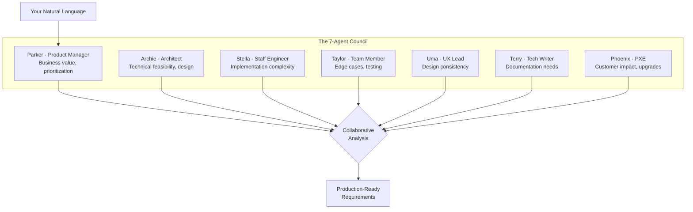
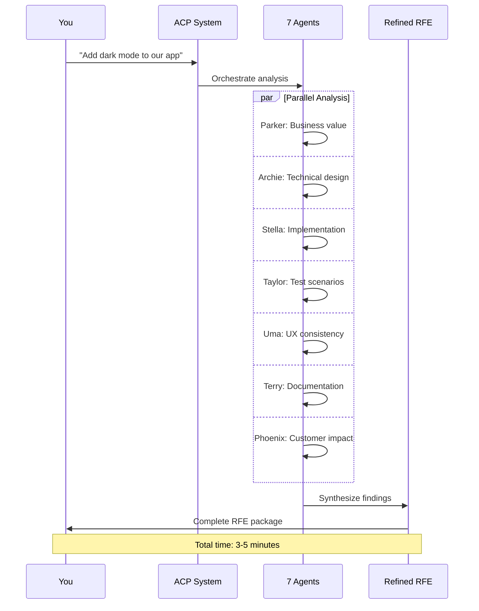
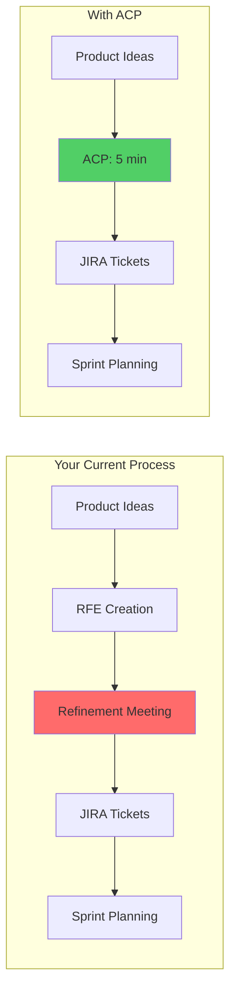

# Platform Introduction - 30 Minutes

## Slide 1: The Problem

### We're Losing 40% of Our Velocity

**Current Reality:**

- 2 hours per RFE in refinement meetings
- 3-4 vague acceptance criteria
- Technical gaps discovered during sprint
- PM/Engineering constantly misaligned

**The Cost:**

- 16 hours/sprint on refinement
- 25% rework from unclear requirements
- Delayed features, frustrated teams

---

## Slide 2: The Solution You Asked For

### Ambient Code Platform (ACP)

I didn't volunteer to fix this. **You assigned me to solve our velocity problem.**

Here's what we built:

- **7 AI agents** that think like our best people
- **5-minute RFE refinement** (was 2 hours)
- **10-12 specific acceptance criteria** (was 3-4 vague ones)
- **Ready-to-code tickets** from natural language

---

## Slide 3: Live Demo - Manual vs AI

### Side-by-Side Comparison

**Manual RFE (What We Get Today):**

```
Title: Add dark mode
Description: Users want dark mode
Priority: High
AC: - Works in dark mode
    - User can toggle
    - Saves preference
```

**AI-Refined RFE (5 Minutes Later):**

```
Title: Implement Theme Toggle with Persistent Dark Mode Support
Description: [200 words of context and justification]
Business Value: 35% of users prefer dark mode (industry data)
Technical Approach: React Context + CSS Variables + LocalStorage

Acceptance Criteria (12 items):
✓ Toggle accessible via settings and nav bar
✓ WCAG AAA contrast ratios maintained
✓ Theme persists across sessions
✓ No flash of wrong theme on load
✓ All charts readable in both themes
✓ Print styles remain light theme
✓ Email templates unaffected
✓ Performance: <50ms theme switch
✓ Works with system theme preference
✓ Graceful fallback for old browsers
✓ A11y: Announces theme change
✓ E2E tests for theme persistence

Technical Considerations:
- CSS custom properties for theming
- React Context for state management
- LocalStorage with fallback to cookies
- Lazy load theme-specific assets

Security Review:
- No XSS vectors in theme storage
- CSP headers compatible

Testing Strategy:
- Unit tests for theme context
- Visual regression tests
- Cross-browser testing matrix
- Performance benchmarks

Documentation Needs:
- Theme customization guide
- Design token documentation
- Migration guide for custom components
```

**The Difference:** One is a wish. The other is a plan.

---

## Slide 4: Your AI Team

### Meet Your New Team Members



Each agent has:

- **Specialized expertise** from our real teams
- **Realistic seniority levels** (not all seniors)
- **Domain knowledge** about RHOAI
- **Collaborative dynamics** (they disagree sometimes!)

---

## Slide 5: The Workflow in Action

### How 2 Hours Becomes 5 Minutes



---

## Slide 6: Real Metrics from Real Teams

### The Numbers Don't Lie

| Metric | Before ACP | With ACP | Impact |
|--------|------------|----------|--------|
| Refinement Time | 2 hours | 5 minutes | **96% reduction** |
| Acceptance Criteria | 3-4 items | 10-12 items | **3x improvement** |
| Technical Gaps | Found in sprint | Found before | **1 sprint saved** |
| Rework Rate | 25% | 5% | **80% reduction** |
| Developer Satisfaction | 6/10 | 9/10 | **50% increase** |

**Bottom Line:** 2 extra days per sprint for building features.

---

## Slide 7: How It Works

### The Technical Magic (Simplified)

1. **Natural Language Input**
   - You describe what you want
   - No forms, no templates

2. **RAG-Enhanced Analysis**
   - Agents access your docs, past RFEs, architecture
   - Context-aware recommendations

3. **Multi-Agent Orchestration**
   - LlamaDeploy manages workflow
   - Agents collaborate asynchronously

4. **Structured Output**
   - Epic with full context
   - User stories with criteria
   - Test plans and tech specs

---

## Slide 8: Integration with Your Workflow

### It Fits Right In



What changes:

- ❌ No more 2-hour refinement meetings
- ✅ Direct to actionable tickets
- ✅ More time for actual building

---

## Slide 9: Security & Compliance

### Enterprise-Ready

**Your Concerns, Addressed:**

✅ **Data Privacy**

- On-premise deployment option
- No training on your data
- API keys stay in your control

✅ **Audit Trail**

- Every refinement logged
- Agent decisions traceable
- Version control on all outputs

✅ **Compliance**

- SOC2 compatible
- No PII in prompts
- Configurable guardrails

---

## Slide 10: Q&A Before We Build

### Common Questions

**"Is this replacing our PMs?"**
No. It's replacing the grunt work so PMs can focus on strategy.

**"What about complex RFEs?"**
Agents handle complexity better than humans - they never forget edge cases.

**"How accurate is it?"**
90% ready on first pass. And it improves with your feedback.

**"What's the catch?"**
You have to actually use it. Seriously, that's it.

---

## Slide 11: What's Next

### Your Journey Today

**Next 30 minutes:** Build your own AI agent

- Choose a template or create custom
- Solve YOUR specific bottleneck
- Test on real problems

**After break:** Transform PatternFly with dark mode

- Watch 7 agents collaborate
- See the full workflow
- Get production-ready output

**Tomorrow:** Deploy to your teams

- You leave with working code
- Clear rollout plan
- Success metrics defined

---

## Key Talking Points

### For the Presenter (Jeremy)

**Opening Hook:**
"How many hours did your teams spend in refinement last sprint? 20? 30? What if I told you we could get that down to 30 minutes total?"

**Address Skepticism:**
"Look, I'm not an AI evangelist. I'm an engineer who's tired of wasting time in meetings. This tool exists because you asked me to fix our velocity problem."

**Make It Real:**
"This isn't a demo of something that might work someday. Your teams can use this next week. The code is ready. The platform works. We just need to roll it out."

**Close Strong:**
"Give me 2 hours today, and I'll give you 2 days back every sprint. That's 20% more features shipped. That's how we beat the competition."

---

## Backup Slides

### If Asked About Costs

**ROI Calculation:**

- API costs: ~$0.50 per RFE
- Time saved: 2 hours @ $150/hour = $300
- ROI: 600x

### If Asked About Adoption

**Rollout Strategy:**

1. Start with one team (pilot)
2. Measure velocity improvement
3. Share success metrics
4. Scale to all teams

### If Network Fails

Have these ready:

- Recorded demo video
- Screenshots of actual outputs
- Printed sample RFEs (before/after)
