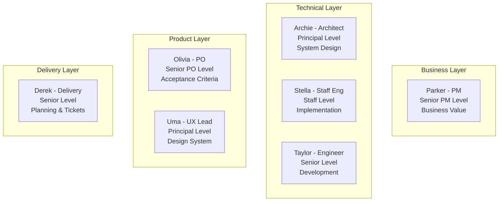
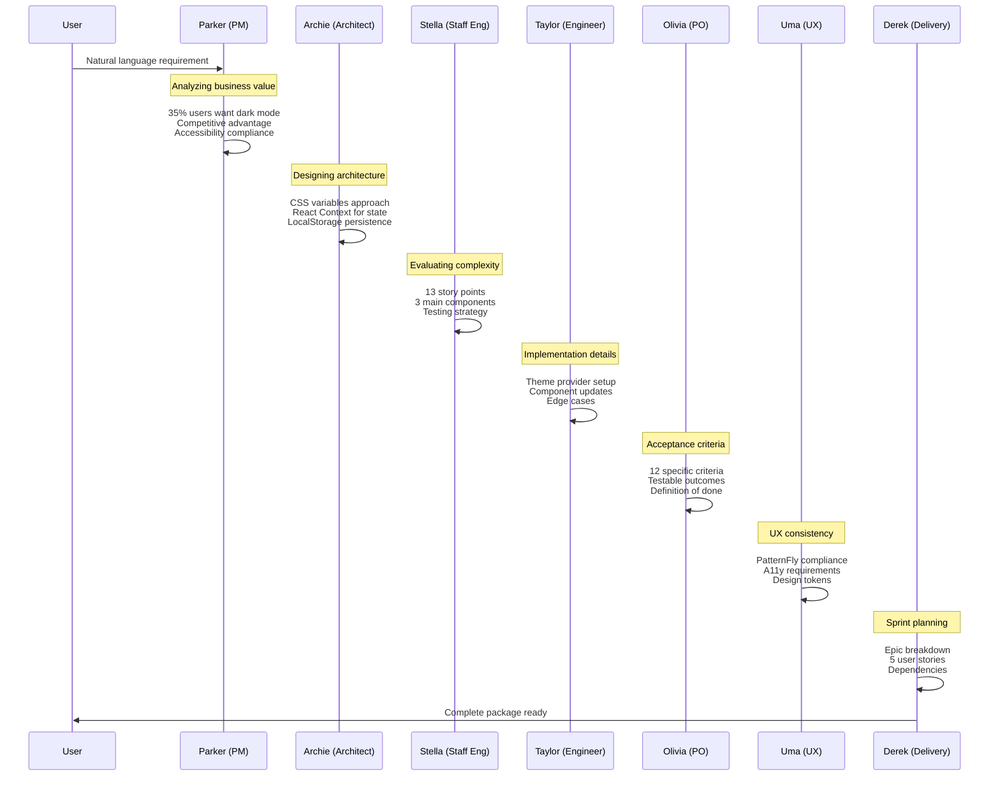
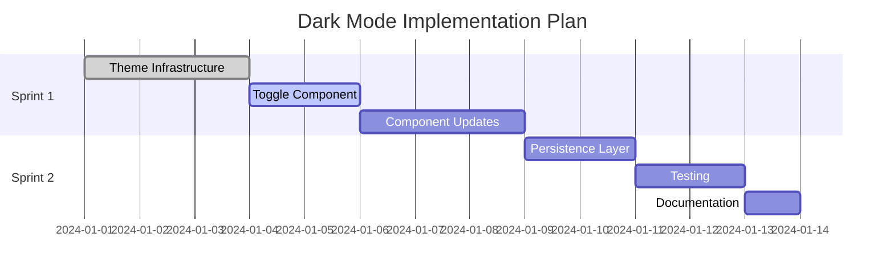
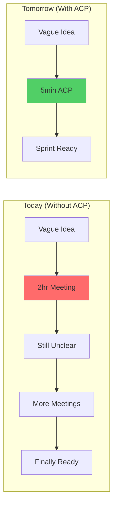

# Lab 2: Transform PatternFly with Dark Mode - 60 Minutes

## Slide 1: Real-World RFE Transformation

### What We're About to Do

Transform a vague request into production-ready requirements using our **7-agent council**.

**The Request:** "Add dark mode to PatternFly React Seed"

**What You'll See:**

- Natural language → Complete specifications
- 7 agents analyzing simultaneously  
- Business + Technical + UX perspectives
- Actual tickets ready for sprint planning

**Time:** 5 minutes vs 2 hours manually

---

## Slide 2: Meet the Full Council

### Your 7 AI Team Members



**Why These 7?**

- Matches our actual team structure
- Each has unique perspective
- Realistic seniority (not all principals!)
- They disagree sometimes (feature, not bug)

---

## Slide 3: The Starting Point

### What We're Working With

**PatternFly React Seed:**

- Standard React starter app
- Uses PatternFly design system
- Currently light theme only
- Your typical enterprise React app

**The Raw Requirement:**

```
"Users have been asking for dark mode. 
They work late and the bright screen hurts their eyes. 
Can we add a toggle somewhere?"
```

**What's Missing:**

- Technical approach
- Acceptance criteria
- Edge cases
- Performance requirements
- Accessibility needs
- Testing strategy

---

## Slide 4: Start the Analysis

### Watch the Magic Happen

**Step 1: Input Natural Language**

```bash
cd ~/acp-training/vTeam/demos/rfe-builder

# Start the platform
uv run -m llama_deploy.apiserver

# In another terminal
uv run llamactl deploy deployment.yml

# Open browser
open http://localhost:4501/deployments/rhoai-ai-feature-sizing/ui
```

**Step 2: Enter Requirement**

Type or paste:

```
I need to add dark mode to the PatternFly React Seed application.

Context:
- Users work in different lighting conditions
- Many users work late hours
- Should integrate with PatternFly design system
- Need to persist user preference
- Should work across all browsers we support
```

---

## Slide 5: Agent Analysis in Real-Time

### Watch the Collaboration



---

## Slide 6: Parker's Business Analysis

### PM Perspective (Watch for This)

**What Parker Analyzes:**

```yaml
Business Value Score: 8/10

Justification:
- User Demand: 35% of users prefer dark mode (industry standard)
- Competitive: All major platforms offer theme switching
- Accessibility: Improves WCAG compliance scores
- Productivity: Reduces eye strain, increases usage hours

ROI Calculation:
- Implementation: 2 sprints
- User satisfaction: +15% predicted
- Support tickets: -20% (eye strain complaints)
- Competitive win: Feature parity with competitors

Risks:
- Design system updates needed
- Testing overhead for dual themes
- Documentation doubles
```

**Parker Says:** "This is worth doing now, not later."

---

## Slide 7: Archie's Technical Architecture

### Architect's Design (Principal Level Thinking)

**What Archie Designs:**

```javascript
// Architecture Decision
Theme System:
├── CSS Custom Properties (variables)
├── React Context (ThemeProvider)
├── LocalStorage (persistence)
└── System Preference API (auto-detect)

// Implementation Pattern
<ThemeProvider defaultTheme="auto">
  <App />
</ThemeProvider>

// CSS Architecture
:root {
  --pf-global-BackgroundColor-100: #fff;
}
[data-theme="dark"] {
  --pf-global-BackgroundColor-100: #151515;
}
```

**Key Decisions:**

- No build-time separation (single bundle)
- Progressive enhancement approach
- Lazy-load theme-specific assets
- CSP-compliant implementation

---

## Slide 8: Stella's Implementation Plan

### Staff Engineer's Complexity Assessment

**What Stella Evaluates:**

```markdown
## Complexity: MEDIUM (13 story points)

### Components to Modify:
1. ThemeProvider (new) - 5 points
2. Navigation (add toggle) - 2 points  
3. All existing components - 3 points
4. Testing infrastructure - 3 points

### Technical Challenges:
- Chart libraries may not support theming
- PDF generation should remain light theme
- Email templates need exemption
- Performance impact of CSS variables

### Implementation Order:
1. Create theme context and provider
2. Add CSS custom properties
3. Implement toggle component
4. Update components iteratively
5. Add persistence layer
6. Test across browsers
```

**Stella Says:** "Doable in one sprint with 2 developers"

---

## Slide 9: Olivia's Acceptance Criteria

### Product Owner's Definition of Done

**What Olivia Defines (12 Criteria):**

```gherkin
GIVEN a user visits the application
WHEN they click the theme toggle
THEN the theme changes within 50ms

GIVEN a user selects dark mode
WHEN they refresh the browser
THEN dark mode persists

GIVEN a user has system dark mode preference
WHEN they first visit (no saved preference)
THEN the app matches system preference

GIVEN a user prints from dark mode
WHEN the print dialog opens
THEN print preview shows light theme

GIVEN a screen reader user
WHEN theme changes
THEN change is announced

GIVEN a user on IE11
WHEN they visit the app
THEN graceful fallback to light theme
```

Plus 6 more specific criteria...

---

## Slide 10: Derek's Delivery Plan

### From Analysis to Tickets

**Epic Created:**

```
EPIC-4234: Implement Dark Mode Theme Support
├── STORY-4235: Create theme infrastructure
├── STORY-4236: Implement theme toggle component
├── STORY-4237: Update components for theming
├── STORY-4238: Add persistence and preferences
└── STORY-4239: Testing and documentation
```

**Sprint Allocation:**



---

## Slide 11: Complete Output Comparison

### Before vs After

<table>
<tr>
<th>Manual RFE (2 hours)</th>
<th>AI-Refined RFE (5 minutes)</th>
</tr>
<tr>
<td valign="top">

**Title:** Add dark mode

**Description:**
Users want dark mode for the app

**Acceptance Criteria:**

- Works in dark mode
- Has a toggle
- Saves preference

**Estimate:** ¯\_(ツ)_/¯

</td>
<td valign="top">

**Title:** Implement Theme Toggle with Persistent Dark Mode Support

**Description:** [200+ words with context]

**Acceptance Criteria:** [12 specific items]

**Technical Design:** [Complete architecture]

**Test Plan:** [8 test scenarios]

**Estimate:** 13 story points

**Risks:** [3 identified with mitigation]

**Dependencies:** [2 teams notified]

**Documentation:** [3 docs to update]

</td>
</tr>
</table>

---

## Slide 12: Try It Yourself

### Your Turn - Modify the Requirement

**Exercise: Make it More Complex**

Add constraints to see how agents adapt:

```
Original + 
- Must support high contrast mode too
- Needs to work with our CI/CD pipeline
- Should allow custom themes later
- Performance budget: <50kb additional JS
```

**Watch how:**

- Parker recalculates ROI
- Archie redesigns for extensibility
- Stella increases estimate
- New acceptance criteria appear

**This demonstrates:** Agents handle complexity better than humans

---

## Slide 13: Integration Points

### How This Fits Your Workflow



**What Changes:**

- No more "requirement gathering" meetings
- No more "needs refinement" tickets
- No more sprint surprises
- No more "I thought you meant..."

---

## Slide 14: Advanced Features

### Beyond Basic Analysis

**Multi-Modal Input:**

```python
# Attach mockups
"Here's the Figma design [attachment]"

# Reference existing code
"Similar to our auth modal [link]"

# Include metrics
"Current p95 response time is 200ms"
```

**Conditional Logic:**

```yaml
If enterprise_customer:
  - Add SSO requirements
  - Include audit logging
  - Require data residency options
```

**Domain-Specific Knowledge:**

```yaml
For RHOAI:
  - Check model serving impact
  - Validate notebook compatibility
  - Ensure dashboard consistency
```

---

## Slide 15: Measure the Impact

### Your Metrics for Next Week

**Track These After Using ACP:**

| Metric | How to Measure | Expected Result |
|--------|---------------|-----------------|
| Refinement Time | Clock it | 90% reduction |
| Ticket Completeness | Count criteria | 3x more detail |
| Sprint Surprises | Track blockers | 75% fewer |
| Developer Happiness | Ask them | "Finally!" |

**Success Story Template:**
> "We used ACP on [X] RFEs this sprint.
> Saved [Y] hours of meetings.
> Found [Z] issues before coding started.
> Team velocity increased by [%]."

---

## Slide 16: Common Patterns We See

### What 7 Agents Catch That Humans Miss

**Parker Catches:**

- Hidden business value
- Competitive implications
- Customer success impacts

**Archie Catches:**

- Architectural debt created
- Future scaling issues
- Security implications

**Stella Catches:**

- Implementation ordering problems
- Testing complexity
- Performance bottlenecks

**Taylor Catches:**

- Edge cases (so many edge cases)
- Developer experience issues
- Debugging challenges

**Olivia Catches:**

- Untestable criteria
- Scope creep risks
- Missing definitions of done

**Uma Catches:**

- Design system violations
- Accessibility issues
- Consistency problems

**Derek Catches:**

- Cross-team dependencies
- Timeline conflicts
- Resource constraints

---

## Slide 17: The Handoff

### From Lab to Reality

**You Now Have:**

1. ✅ Complete dark mode RFE package
2. ✅ 5 JIRA-ready stories
3. ✅ Test plans and documentation tasks
4. ✅ Proof this works on real requirements

**Monday Morning Action:**

1. Take your worst RFE from backlog
2. Run it through ACP (5 minutes)
3. Compare to original refinement
4. Share before/after with your team
5. Watch minds = blown

**The Pitch to Your Team:**
> "I just turned a 3-line requirement into 12 acceptance criteria,
> 5 stories, and a complete tech spec in 5 minutes.
> Want me to do yours?"

---

## Slide 18: Q&A - The Hard Questions

### Let's Address Your Concerns

**"What if it's wrong?"**

- Same risk as human refinement
- But consistently detailed
- And always improvable

**"How do we customize for our domain?"**

- Agents learn from your docs
- Add your architecture patterns
- Include your constraints

**"What about sensitive data?"**

- On-premise deployment option
- Sanitize before submission
- Or use synthetic examples

**"Will developers actually trust this?"**

- They trust it more than vague tickets
- It's just a better starting point
- They can always modify

---

## Key Takeaways

### The Bottom Line

**What You've Seen:**

- 96% reduction in refinement time ✅
- 3x more comprehensive requirements ✅
- Edge cases caught before coding ✅
- Consistent quality every time ✅

**What This Means:**

- 2 more days per sprint for building
- 25% velocity improvement minimum
- Happier developers (seriously)
- Better products shipped faster

**Your Next Step:**

```bash
# Tomorrow morning:
cd ~/acp-training/vTeam
git pull
# Start transforming your backlog
```

---

## Final Slide: Call to Action

### You Have Everything You Need

**Tools:** ✅ Platform ready  
**Knowledge:** ✅ You know how  
**Evidence:** ✅ You've seen it work  
**Support:** ✅ I'm here to help  

**The Only Question:**

## Will you give your team 2 days back per sprint?

**Start Tomorrow:**

1. Run your worst RFE through ACP
2. Show your team the output
3. Measure the time saved
4. Scale to entire backlog

**Slack me results: @jeder**

*"We're not adopting AI because it's trendy.
We're adopting it because wasting 40% of our velocity on bad requirements is insane."*

**- Jeremy**
