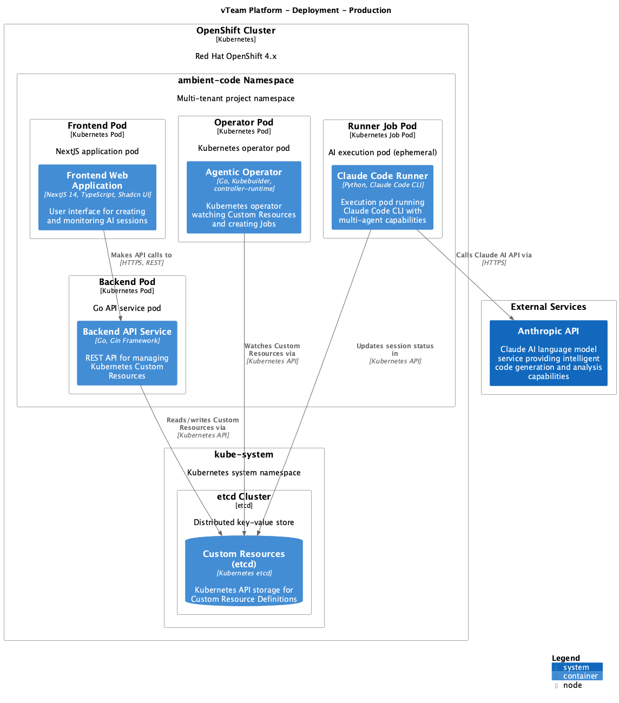

# vTeam Platform Architecture

> Kubernetes-native AI automation platform for intelligent agentic sessions with multi-agent collaboration

## Overview

vTeam (Ambient Agentic Runner) is built on a microservices architecture deployed to Kubernetes/OpenShift. The platform enables engineering teams to create and manage AI-powered agentic sessions through a modern web interface, backed by a robust operator pattern for job orchestration.

**Architecture Model**: This documentation follows the [C4 model](https://c4model.com) for software architecture visualization.

## System Context

### Users

**Platform User** (Engineering Team Member)
- Creates and manages AI-powered agentic sessions
- Monitors session progress through web interface
- Reviews analysis results and structured output

**Platform Administrator** (Red Hat SRE/Platform Team)
- Deploys and manages vTeam infrastructure
- Configures multi-tenant project namespaces
- Manages platform resources and quotas

### External Systems

**Anthropic API**
- Claude AI language model service
- Provides intelligent code generation and analysis capabilities
- Accessed via HTTPS REST API

**Kubernetes/OpenShift Cluster**
- Container orchestration platform
- Provides compute, storage, and networking infrastructure
- Hosts all vTeam containers and manages workload scheduling

**GitHub**
- Source code repository and version control
- CI/CD platform for automated builds and deployments
- Deployment automation via GitHub Actions

## Container Architecture

The vTeam platform consists of four main containers deployed as Kubernetes pods:

### 1. Frontend Web Application

**Technology**: NextJS 14, TypeScript, Shadcn UI

**Purpose**: User interface for creating and monitoring agentic sessions

**Key Responsibilities**:
- Session creation and management interface
- Project organization (multi-tenant)
- Runner secrets and API key configuration
- Real-time session progress updates
- OpenShift OAuth authentication integration

**Deployment**: Runs as a Kubernetes pod in the ambient-code namespace

**Access**: Exposed via OpenShift Route or Kubernetes Service

### 2. Backend API Service

**Technology**: Go, Gin Framework

**Purpose**: REST API for managing Kubernetes Custom Resources

**Key Responsibilities**:
- Projects API: Multi-tenant project CRUD operations
- Sessions API: Agentic session lifecycle management
- Secrets API: Secure storage of runner API keys
- RBAC enforcement and multi-tenancy isolation
- Kubernetes Custom Resource management via client-go

**Deployment**: Runs as a Kubernetes pod with service account for K8s API access

**Communication**: HTTPS REST API consumed by Frontend

### 3. Agentic Operator

**Technology**: Go, Kubebuilder, controller-runtime

**Purpose**: Kubernetes operator watching Custom Resources and creating Jobs

**Key Responsibilities**:
- Project Controller: Reconciles Project CRs, manages namespaces
- Session Controller: Reconciles AgenticSession CRs, creates Jobs
- Resource Manager: Manages quotas, network policies, RBAC
- Job Orchestrator: Creates and monitors Kubernetes Jobs for AI runners

**Deployment**: Runs as a Kubernetes Deployment with cluster-level RBAC

**Pattern**: Follows Kubernetes Operator pattern with reconciliation loops

### 4. Claude Code Runner

**Technology**: Python, Claude Code CLI

**Purpose**: Execution pod running AI tasks with multi-agent capabilities

**Key Responsibilities**:
- Agent Loader: Orchestrates 17 specialized AI agents
- MCP Integration: Model Context Protocol for browser automation
- Session Executor: Executes AI tasks and stores results
- Claude API Client: Communicates with Anthropic API

**Deployment**: Ephemeral Kubernetes Job pods (created per session)

**Lifecycle**: Created on-demand, terminated after session completion

### Data Storage

**Custom Resources (Kubernetes etcd)**
- Stores AgenticSession and Project Custom Resource Definitions
- Managed via Kubernetes API
- Provides persistence and state management

**Kubernetes Secrets**
- Encrypted storage for API keys and credentials
- Project-scoped secret isolation
- Accessed by Runner pods during execution

## Component Architecture

### Frontend Components

**Session Management UI**
- Create, monitor, and manage agentic sessions
- React components with real-time updates

**Project Management UI**
- Multi-tenant project organization
- Project CRUD operations

**Settings & Secrets UI**
- Configure runner secrets and API keys
- Secure credential management

**Authentication Handler**
- OpenShift OAuth integration via NextAuth.js
- User authentication and session management

### Backend Components

**Projects API**
- Multi-tenant project CRUD operations
- Go HTTP handlers with Gin framework

**Sessions API**
- Agentic session lifecycle management
- REST endpoints for session operations

**Secrets API**
- Secure storage of runner API keys
- Kubernetes Secrets integration

**RBAC Middleware**
- Authorization and multi-tenancy enforcement
- Request validation and user context

**Kubernetes Client**
- Custom Resource management via client-go
- Direct interaction with Kubernetes API

### Operator Components

**Project Controller**
- Reconciles Project Custom Resources
- Manages tenant namespaces and resources

**Session Controller**
- Reconciles AgenticSession Custom Resources
- Creates Kubernetes Jobs for AI execution

**Resource Manager**
- Manages quotas, network policies, and RBAC
- Ensures tenant isolation

**Job Orchestrator**
- Creates and monitors Kubernetes Jobs
- Manages runner pod lifecycle

### Runner Components

**Agent Loader**
- Loads and orchestrates 17 specialized AI agents
- Provides agent context and configuration

**MCP Integration**
- Model Context Protocol for browser automation
- Enables web interaction capabilities

**Session Executor**
- Executes AI tasks and stores results
- Coordinates agent workflows

**Claude API Client**
- Communicates with Anthropic API via HTTPS
- Manages API requests and responses

## Deployment Architecture

### Production Deployment (OpenShift)

**OpenShift Cluster** (Red Hat OpenShift 4.x)

**ambient-code Namespace**
- Frontend Pod: NextJS application
- Backend Pod: Go API service
- Operator Pod: Kubernetes operator
- Runner Job Pods: AI execution (ephemeral)

**kube-system Namespace**
- etcd Cluster: Distributed key-value store for Custom Resources

**External Services**
- Anthropic API: Claude AI service (HTTPS)

### Networking

- Frontend exposed via OpenShift Route (HTTPS)
- Backend accessible within cluster (ClusterIP Service)
- Operator watches Kubernetes API
- Runner pods access Anthropic API and Kubernetes API

### Security

- RBAC: Comprehensive role-based access controls
- Network Policies: Component isolation
- Secret Management: Kubernetes-native encrypted storage
- OAuth: OpenShift OAuth integration for authentication

## Session Creation Flow

### Runtime Interaction Sequence

1. **User creates new AI session** via Frontend web interface
2. **Frontend calls Backend API** via POST /api/sessions (HTTPS)
3. **Backend creates AgenticSession CR** in Kubernetes etcd
4. **Operator watches CR creation** via Kubernetes API watch
5. **Operator creates Kubernetes Job** for runner pod
6. **Kubernetes schedules runner pod** based on available resources
7. **Runner executes AI tasks** via Claude API (Anthropic)
8. **Runner updates session status** in AgenticSession CR
9. **Frontend polls session status** via Backend API
10. **Backend reads updated CR** from Kubernetes API
11. **Backend returns results** to Frontend
12. **Frontend displays session output** to user

### Key Characteristics

**Asynchronous Processing**: Frontend polls for updates while Runner executes in background

**Kubernetes-Native**: Leverages Custom Resources and Operators for orchestration

**Multi-Tenant**: Projects and sessions isolated via namespaces and RBAC

**Ephemeral Execution**: Runner pods created on-demand and terminated after completion

## Technology Stack

### Frontend
- **Framework**: NextJS 14 (React)
- **Language**: TypeScript
- **UI Library**: Shadcn UI components
- **Authentication**: NextAuth.js with OpenShift OAuth
- **Build**: Webpack (Next.js default)

### Backend
- **Language**: Go
- **Web Framework**: Gin
- **Kubernetes Client**: client-go
- **API Style**: REST

### Operator
- **Language**: Go
- **Framework**: Kubebuilder
- **Controller**: controller-runtime
- **Pattern**: Kubernetes Operator with reconciliation

### Runner
- **Language**: Python
- **AI CLI**: Claude Code CLI
- **AI SDK**: Anthropic Python SDK
- **Protocol**: Model Context Protocol (MCP)

### Infrastructure
- **Orchestration**: Kubernetes / OpenShift 4.x
- **Storage**: etcd (via Kubernetes)
- **Secrets**: Kubernetes Secrets
- **Networking**: OpenShift Routes, ClusterIP Services
- **CI/CD**: GitHub Actions

## Design Principles

### Kubernetes-Native
- Custom Resources for domain models
- Operators for workflow orchestration
- Native RBAC and secret management
- Declarative configuration

### Multi-Tenancy
- Project-based namespace isolation
- RBAC enforcement at API and operator levels
- Quota management per tenant
- Secret isolation

### Scalability
- Horizontal pod autoscaling
- Ephemeral job execution
- Stateless containers
- Resource request/limit management

### Observability
- Health check endpoints
- Prometheus metrics
- Structured logging
- OpenShift monitoring integration

## Architecture Decisions

### Why Kubernetes Operators?

**Decision**: Use Kubernetes Operator pattern for session orchestration

**Rationale**:
- Declarative Custom Resources match domain model
- Reconciliation loops provide resilience
- Native Kubernetes integration
- Proven pattern for complex workflows

**Alternatives Considered**:
- Direct job creation from Backend API
- External workflow engine (Argo, Tekton)

### Why Ephemeral Runner Pods?

**Decision**: Create new pod per session instead of persistent runners

**Rationale**:
- Resource efficiency (no idle pods)
- Isolation between sessions
- Clean state per execution
- Kubernetes-native job pattern

**Trade-offs**:
- Slight startup latency vs persistent pods
- Pod scheduling overhead

### Why Go for Backend/Operator?

**Decision**: Use Go for Kubernetes-native components

**Rationale**:
- Native Kubernetes client libraries
- Strong concurrency primitives
- Performance for API and reconciliation loops
- Ecosystem alignment (most operators in Go)

**Alternatives Considered**:
- Python: Better for AI integration, slower for high-throughput APIs
- TypeScript: Good for full-stack consistency, less mature K8s libraries

## Related Documentation

- **Detailed Architecture**: [../../architecture/README.md](../../architecture/README.md)
- **C4 Model Source**: [../../architecture/workspace.dsl](../../architecture/workspace.dsl)
- **Deployment Guide**: [../OPENSHIFT_DEPLOY.md](../OPENSHIFT_DEPLOY.md)
- **OAuth Setup**: [../OPENSHIFT_OAUTH.md](../OPENSHIFT_OAUTH.md)

## Architecture Evolution

### Current State (v1.0)
- Single-cluster deployment
- Basic multi-tenancy via namespaces
- Manual secret management via UI

### Planned Enhancements
- Multi-cluster federation
- Advanced RBAC with policy engine
- Automated secret rotation
- Enhanced observability with distributed tracing

---

**Last Updated**: 2025-09-30
**Architecture Model**: C4 (Context, Container, Component, Code)
**Maintained By**: vTeam Architecture Team
