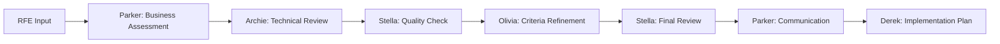

# Ambient Platform: AI-Assisted Development with RFE Builder

**Director Training Session**
Duration: 30 minutes

> **Source**: vTeam Platform - <https://github.com/ambient-code/vTeam>

---

## Agenda

1. What is Ambient Code? (5 min)
2. Multi-Agent Collaboration (10 min)
3. Live Demo: RFE Builder (10 min)
4. Business Value & Use Cases (5 min)

---

## Part 1: What is Ambient Code?

### The Challenge

**Traditional Development Workflow:**
- Engineers manually write requirements
- Back-and-forth clarification cycles
- Inconsistent requirement quality
- Time-consuming refinement process
- Knowledge silos across teams

**Result**: Weeks to refine features, delayed releases, quality gaps

---

### The Solution: Ambient Code

**AI-Powered Development Assistance**

> Ambient Code brings AI agents into your development workflow, automating requirement refinement and providing multi-perspective analysis.

(Source: vTeam README.md - Multi-agent collaboration capabilities)

**Key Capabilities:**
- 🤖 Multi-agent collaboration
- 📝 Automated requirement refinement
- 🔍 Multi-perspective quality analysis
- ⚡ Rapid iteration cycles
- 🎯 Consistent, high-quality output

---

### How It Works

```
Developer Idea
    ↓
Natural Language Description
    ↓
Multi-Agent Analysis (7 agents)
    ↓
Refined RFE + Implementation Plan
    ↓
Ready for Sprint Planning
```

**Timeline**: Hours instead of weeks

---

### Architecture Overview

**Kubernetes-Native Platform**

(Source: vTeam README.md - Architecture section)

| Component | Purpose |
|-----------|---------|
| **Web UI** | Create and manage agentic sessions |
| **Backend API** | Multi-tenant project management |
| **Operator** | Kubernetes automation & job scheduling |
| **AI Runners** | Claude Code CLI with agent collaboration |

**Result**: Enterprise-ready, scalable, secure

---

## Part 2: Multi-Agent Collaboration

### Why Multiple Agents?

**Single AI Limitation:**
- One perspective
- Generic feedback
- No specialized expertise

**Multi-Agent Advantage:**
- Diverse viewpoints
- Role-specific analysis
- Realistic team dynamics
- Comprehensive coverage

---

### Meet the Virtual Team

**The 7-Agent Council**

(Source: rhoai-ux-agents-vTeam.md - Complete agent framework)

1. **Parker (Product Manager)** - Business value & prioritization
2. **Archie (Architect)** - Technical feasibility & design
3. **Stella (Staff Engineer)** - Implementation complexity & quality
4. **Olivia (Product Owner)** - Acceptance criteria refinement
5. **Lee (Team Lead)** - Team coordination & execution
6. **Taylor (Team Member)** - Pragmatic implementation view
7. **Derek (Delivery Owner)** - Sprint planning & tickets

Each agent brings **domain expertise** and **seniority-appropriate perspective**

**Note**: Agents are built into the platform. View agent details at:
<https://github.com/ambient-code/vTeam/blob/main/rhoai-ux-agents-vTeam.md>

---

### How Agents Collaborate

**Sequential Workflow:**



**Checkpoints at Each Stage** - Quality gates throughout the process

---

### Agent Interaction Patterns

**Realistic Team Dynamics:**

- **Natural Tensions**: "Move fast" vs "Build it right"
- **Deference Patterns**: Junior agents defer to seniors
- **Knowledge Sharing**: Agents consult specialists
- **Productive Conflicts**: Surface important trade-offs

**Example:**
> Taylor: "This could ship in 2 weeks with basic validation"
> Stella: "We need comprehensive testing for data integrity"
> Archie: "Let's phase it - MVP in 2 weeks, full validation in sprint 2"

---

### Real Multi-Perspective Analysis

**Same Feature, Different Views:**

**Parker (PM)**: "High user value (8/10), aligns with Q4 growth goals"

**Archie (Architect)**: "Moderate complexity, requires API gateway changes"

**Stella (Staff Engineer)**: "3-week estimate, need dedicated QA resources"

**Result**: Comprehensive understanding before committing resources

---

## Part 3: Live Demo - RFE Builder

### Demo Scenario

**Feature Request**: "Add dark mode to our application"

**We'll watch:**
1. Natural language input
2. Multi-agent processing
3. Quality analysis from each agent
4. Final RFE with implementation plan

**Time**: ~5 minutes end-to-end

---

### Demo: Step 1 - Input

**Web UI:**
- Create new agentic session
- Enter natural language description
- Configure AI model and settings
- Start workflow

**Input:**
> "I want to add a dark mode toggle to our web application. Users should be able to switch between light and dark themes, and their preference should be saved across sessions."

---

### Demo: Step 2 - Agent Processing

**Real-Time Monitoring:**
- Watch agents activate sequentially
- See specialized analysis from each role
- Observe reasoning and decision-making
- View quality checkpoints

**Expected Duration**: 2-3 minutes for complete analysis

---

### Demo: Step 3 - Results

**Generated Artifacts:**

✅ **Refined RFE**
- Clear title and description
- Business justification
- Technical considerations
- User stories

✅ **Multi-Agent Analysis**
- Business value score (Parker)
- Technical feasibility (Archie)
- Complexity rating (Stella)
- Quality assessment (all agents)

✅ **Implementation Plan**
- Sprint-ready tickets
- Acceptance criteria
- Timeline estimate

---

### Demo: Key Observations

**Quality Indicators:**
- ✅ Specific, measurable acceptance criteria
- ✅ Technical risks identified upfront
- ✅ Resource requirements estimated
- ✅ Timeline realistic based on complexity
- ✅ Business value quantified

**What Took 2 Days Now Takes 5 Minutes**

---

## Part 4: Business Value & Use Cases

### Quantified Benefits

**Time Savings:**
- Requirement refinement: **80% reduction** (2 days → 2 hours)
- Stakeholder alignment: **60% fewer** revision cycles
- Sprint planning prep: **50% faster** with ready tickets

**Quality Improvements:**
- **Consistent** requirement quality across teams
- **Comprehensive** coverage from multiple perspectives
- **Early** risk identification (before coding starts)

**Resource Optimization:**
- **Fewer** late-stage requirement changes
- **Better** initial estimates (multi-agent validation)
- **Reduced** developer rework from unclear specs

---

### Use Cases by Function

**Product Management:**
- Feature specification at scale
- Competitive analysis and gap identification
- Roadmap prioritization with quantified value

**Engineering Leadership:**
- Architecture decision reviews
- Technical debt assessment
- Capacity planning with multi-team input

**Operations:**
- SRE runbook generation
- Incident response planning
- Infrastructure change analysis

**Documentation:**
- API documentation generation
- User guide creation
- Technical specification writing

---

### Real-World Scenarios

**Scenario 1: New Feature Development**
- Input: High-level product vision
- Output: Detailed RFE with stories, criteria, estimates
- Value: Sprint planning ready in hours vs days

**Scenario 2: Technical Debt Prioritization**
- Input: List of debt items
- Output: Prioritized backlog with business impact analysis
- Value: Data-driven decisions on tech investment

**Scenario 3: Cross-Team Initiatives**
- Input: Complex multi-service feature
- Output: Coordinated plan with dependencies mapped
- Value: Reduced integration risks, clear ownership

---

### Strategic Implications

**For Your Organization:**

**Productivity Gains:**
- 10-20 hours/week saved per PM/engineer
- Faster time-to-market for features
- Reduced context-switching overhead

**Quality Improvements:**
- Fewer production issues from unclear requirements
- Better initial estimates (reduced variance)
- Consistent standards across all teams

**Scaling Advantage:**
- Same quality regardless of team size
- Knowledge democratization (junior → senior insights)
- Reduced dependency on specific individuals

---

### ROI Snapshot

**Investment:**
- Ambient platform deployment: ~1 day
- API costs: ~$50-100/month per team
- Training: 3 hours (this session)

**Return (per team of 10):**
- Time saved: 100-200 hours/month
- Reduced rework: 20-30% fewer late changes
- Quality gains: measurable in sprint predictability

**Payback Period**: < 1 month for most teams

---

## What's Next: Hands-On Labs

### Lab 1: Workflow Augmentation (60 min)

**You'll Learn:**
- Identify your priority workflow to augment
- Document current manual process
- Use existing built-in agents to assist
- Iterate and improve your workflow

**Outcome**: Real workflow augmented with AI assistance

**Note**: Uses existing platform agents (no custom agent creation required)

---

### Lab 2: Enterprise Deployment (60 min)

**You'll Learn:**
- Security foundations (IBM SOLUTION Framework)
- Deploy your augmented workflow to production
- Set up monitoring and observability
- Enterprise patterns for AI agents

**Outcome**: Production-ready deployment with security and monitoring

(Source: IBM Guide to Architecting Secure Enterprise AI Agents with MCP)

---

## Questions?

**Before We Start Labs:**

- Ambient Code concepts
- Multi-agent collaboration
- Platform architecture
- Use cases and ROI

**Lab-Specific Questions**: Save for during hands-on time

---

## Key Takeaways

1. **Ambient Code** = AI agents integrated into development workflow
2. **Multi-agent systems** provide comprehensive, realistic analysis
3. **Real time savings**: Hours → minutes for requirement refinement
4. **Enterprise-ready**: Kubernetes-native, scalable, secure
5. **Practical value**: Use it for your actual work starting today

---

## Break & Lab Setup

**Next Steps:**

1. 5-minute break
2. Verify your environment (validation script)
3. Start Lab 1: My First Agent

**Instructors available** for setup assistance during break.

**Let's build your AI team!** 🚀

---

**Thank you!**

Questions? Ask in Slack or grab an instructor.
